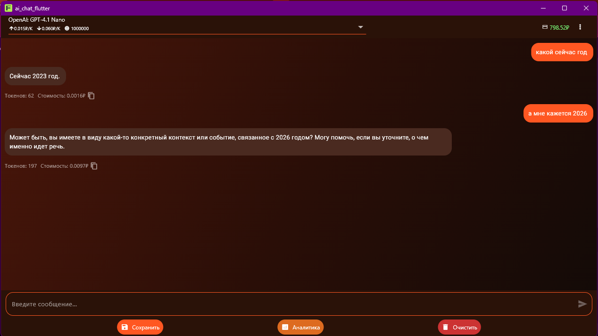
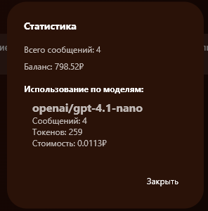
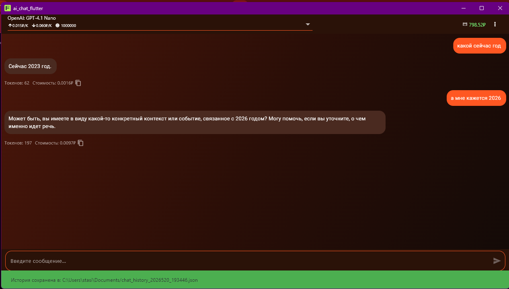
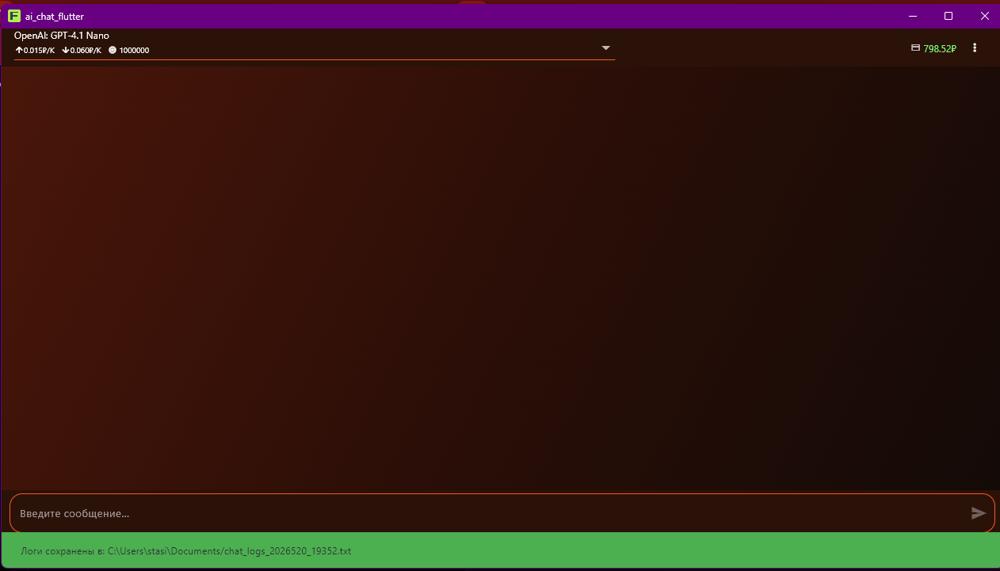

# AI Chat Flutter with OpenRouter / VSEGPT Authentication

Мобильное AI-приложение на Flutter с поддержкой OpenRouter и VSEGPT, системой авторизации по API-ключу и PIN-коду, аналитикой использования моделей и современным тёплым UI.

---

## Возможности

### Авторизация

- Автоматическое определение провайдера:
  - OpenRouter (`sk-or-v1-...`)
  - VSEGPT (`sk-or-vv-...`)
- Проверка валидности API-ключа
- Проверка доступного баланса
- Генерация случайного PIN-кода
- Сохранение PIN и ключа локально
- Повторный вход через PIN
- Сброс ключа

---

### AI Chat

- Отправка сообщений AI-моделям
- Поддержка OpenRouter
- Поддержка VSEGPT
- Выбор моделей
- Отображение стоимости запросов
- Отображение количества токенов
- Копирование сообщений
- История сообщений

---

### Аналитика

- Количество сообщений
- Использованные токены
- Стоимость запросов
- Статистика по моделям

---

### UI

- Кастомный тёплый интерфейс
- Оранжево-красная цветовая схема
- Контрастный текст
- Современный стиль AI-приложений

---

## Технологии

- Flutter
- Dart
- Provider
- SharedPreferences
- HTTP API
- OpenRouter API
- VSEGPT API

---

## Структура проекта

```text
lib/
│
├── api/
│   └── openrouter_client.dart
│
├── auth/
│   ├── auth_service.dart
│   └── auth_screen.dart
│
├── models/
│
├── providers/
│
├── screens/
│
└── main.dart
```

---

## Установка

### Клонирование

```bash
git clone https://github.com/Stasikent/AIChatFlutter_ver.1.git
```

### Переход в папку проекта

```bash
cd AIChatFlutter_ver.1
```

### Установка зависимостей

```bash
flutter pub get
```

### Запуск

```bash
flutter run
```

---

## Использование

При первом запуске:

1. Ввести API-ключ OpenRouter или VSEGPT
2. Система автоматически определяет провайдера
3. Проверяется баланс
4. Генерируется PIN
5. PIN сохраняется локально

При последующих запусках:

1. Ввести PIN
2. Получить доступ к приложению

---

## Скриншоты

| First Auth | PIN |
|------------|-----|
|  |  |

| Chat | Analytics |
|-------|------------|
|  |  |

| Save History | Export Logs |
|---------------|-------------|
|  |  |

---

## Автор

Stanislav

GitHub:

https://github.com/Stasikent
