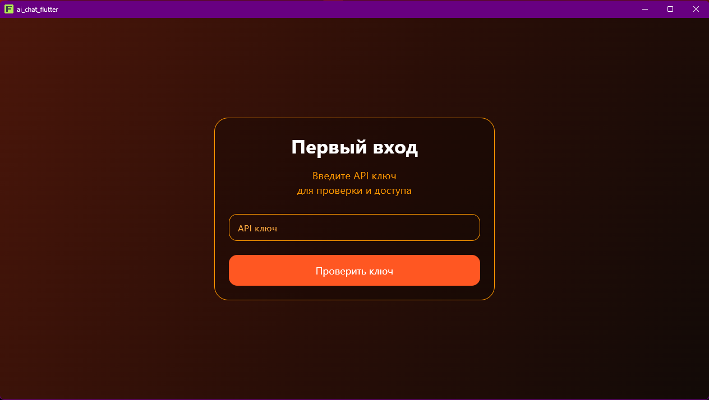
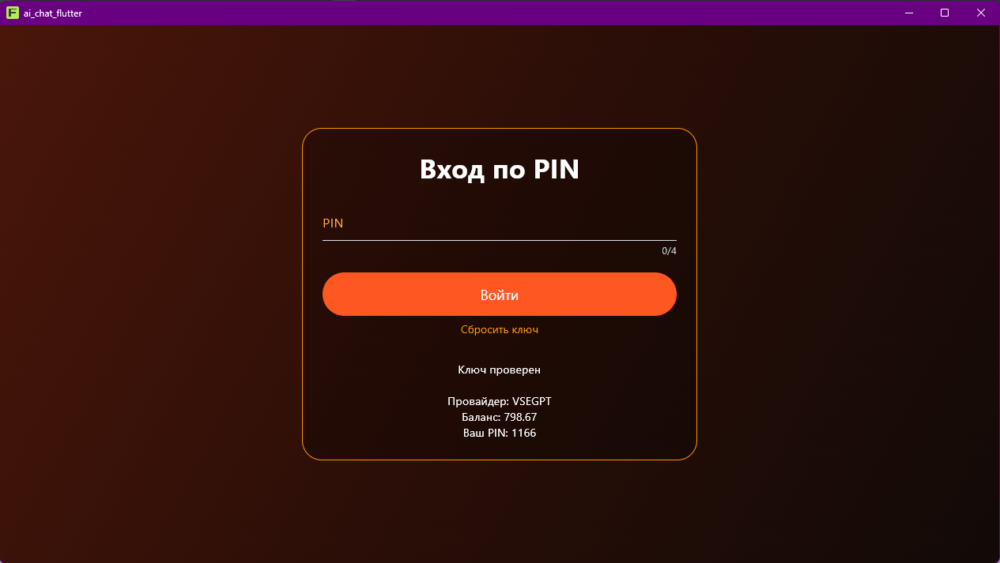
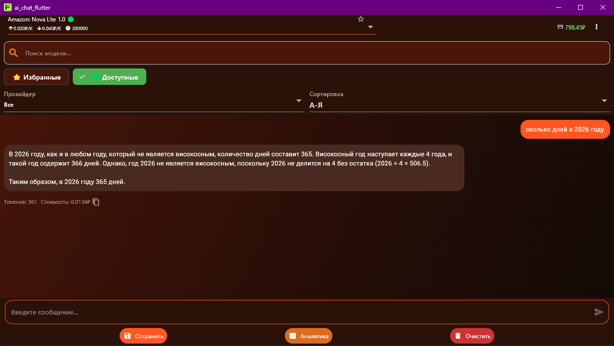
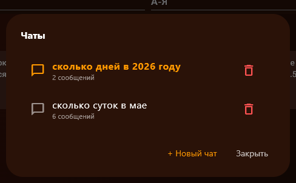
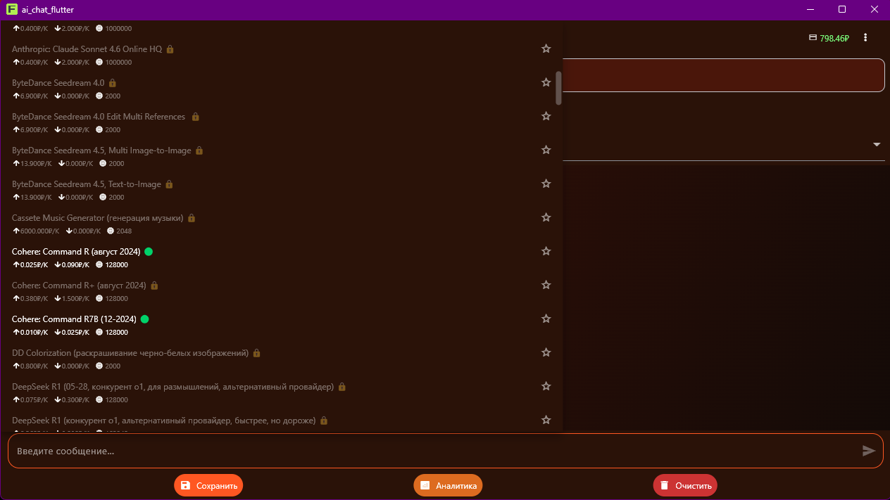
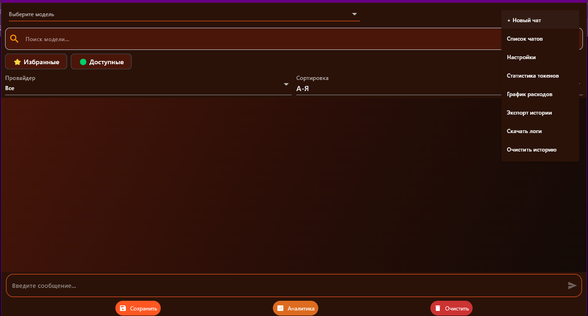
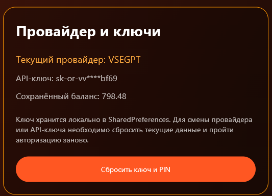

# AIChatFlutter v1

AIChatFlutter — десктопное AI-приложение на Flutter с поддержкой VSEGPT/OpenRouter, PIN-авторизацией, несколькими чатами, аналитикой использования и интеллектуальной системой работы с AI-моделями.

---

## Возможности

## Авторизация и безопасность

- Авторизация через API-ключ
- Автоматическое определение провайдера:

  - OpenRouter (`sk-or-v1-...`)
  - VSEGPT (`sk-or-vv-...`)

- Проверка валидности API-ключа
- Проверка баланса
- Генерация PIN-кода
- Вход по PIN
- Локальное хранение API-ключа
- Сброс API-ключа и PIN

---

## Чаты

- Несколько независимых чатов
- Автоматическое название чатов
- Переключение между чатами
- Удаление чатов
- Автосохранение истории
- Экспорт истории
- Копирование сообщений
- Отображение стоимости сообщений
- Отображение использованных токенов

---

## Работа с AI-моделями

Поддерживаются:

- OpenRouter API
- VSEGPT API

Функции:

- Поиск моделей
- Избранные модели
- Фильтр доступных моделей
- Блокировка недоступных моделей
- Сортировка:

  - А-Я
  - Я-А
  - Цена ↑
  - Цена ↓
  - Контекст ↑

- 🏷 Фильтрация по провайдерам:

  - OpenAI
  - DeepSeek
  - Claude
  - Gemini
  - NVIDIA
  - Qwen
  - Llama
  - Cohere
  - Amazon
  - Mistral
  - и другие

- Автоматическая проверка доступности моделей VSEGPT
- Определение доступности моделей по тарифу

---

## Аналитика

- График расходов
- Статистика токенов
- Статистика моделей
- Анализ стоимости запросов
- Анализ использования AI

---

## Интерфейс

- Тёплая цветовая схема
- Навигационное меню
- Современный AI UI
- Адаптивный интерфейс
- Десктопный режим

---

## Технологии

- Flutter
- Dart
- Provider
- SharedPreferences
- SQLite
- HTTP API
- OpenRouter API
- VSEGPT API

---

## Структура проекта

```text
lib/
│
├── api/
│   └── openrouter_client.dart
│
├── auth/
│   ├── auth_service.dart
│   └── auth_screen.dart
│
├── models/
│   ├── chat_session.dart
│   └── message.dart
│
├── pages/
│   ├── analytics_chart_page.dart
│   ├── provider_settings_page.dart
│   └── token_statistics_page.dart
│
├── providers/
│   └── chat_provider.dart
│
├── screens/
│   └── chat_screen.dart
│
├── services/
│   ├── usage_stats_service.dart
│   └── vsegpt_access_service.dart
│
└── main.dart
```

---

## Установка

### Клонирование проекта

```bash
git clone https://github.com/Stasikent/AIChatFlutter_ver.1.git
```

### Переход в папку проекта

```bash
cd AIChatFlutter_ver.1
```

### Установка зависимостей

```bash
flutter pub get
```

### Запуск

```bash
flutter run
```

---

## Использование

### Первый запуск

1. Введите API-ключ OpenRouter или VSEGPT
2. Система автоматически определит провайдера
3. Выполнится проверка ключа
4. Получится баланс
5. Будет создан PIN-код
6. Данные сохранятся локально

### Последующие запуски

1. Введите PIN-код
2. Получите доступ к чатам

---

## Скриншоты

### Первый запуск



---

### Авторизация по PIN



---

### Основной экран



---

### Список чатов



---

### Фильтрация моделей

Поддерживается:

- избранное
- доступные модели
- недоступные модели
- поиск
- сортировка
- фильтрация провайдеров



---

### Навигационное меню



---

### Настройки



---

## Автор

Stanislav

GitHub:

https://github.com/Stasikent